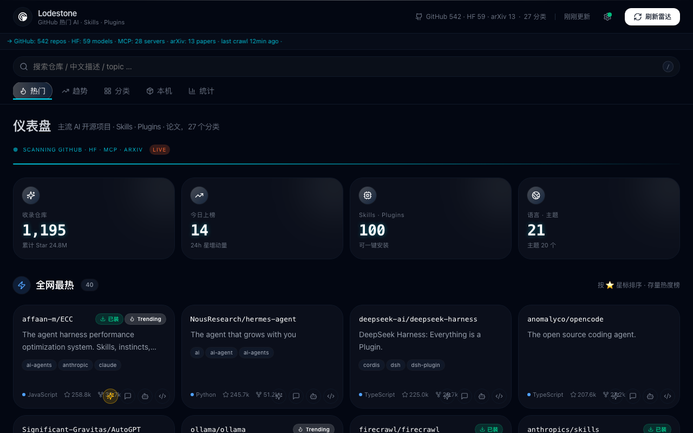
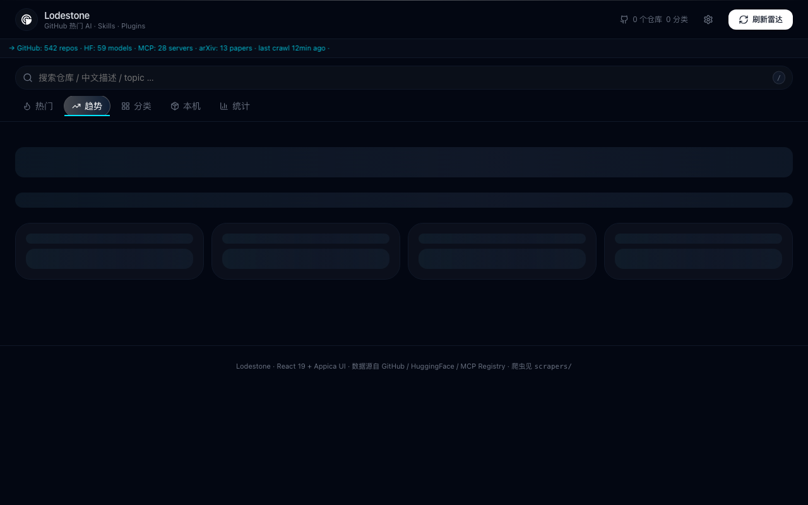
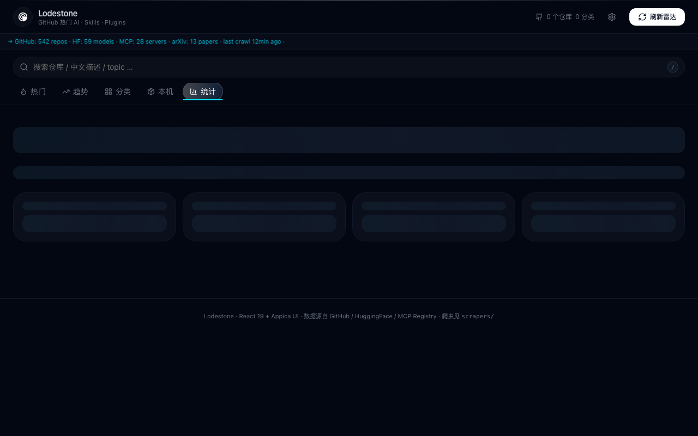

# ⚡ Lodestone

**每天 5 分钟，给 AI 工程师一份"现在值得关注"清单。**

> 把 GitHub、HuggingFace、MCP Registry、arXiv、awesome 列表、HackerNews 七个数据洋流汇成一张中文友好仪表盘——按 27 个用途分类，不刷十几个 RSS。

<p>
  
</p>

---

## 🧭 数据怎么流

```
            4 数据洋流                        4 级爬虫兜底
                                                   ┌─ httpx ─── 多数直接命中
  GitHub   ──┐                                  ├─ cloudscraper ── 破 Cloudflare
  HuggingFace ─┼─→ 抓 · 去重 · AI 过滤 ──→ 仪表盘 ──┤
  MCP Reg    ─┤                                  ├─ playwright_stealth ── 真浏览器
  arXiv      ─┘                                  └─ jina ── 本地 IP 被封换出口
                   ↓
               Postgres（推荐）/ JSON 回退
                   ↓
               ┌─ 卡片墙：hot / trending / 分类 / 24h 星增
               ├─ 5 桶详情：是什么 / 能干什么 / 解决什么问题 / 同类 / 何时选它
               └─ 一键装为 skill（仓库根有 SKILL.md 时）
```

GitHub 抗爬时其他 6 个源照常工作——你不会"今天啥都看不到"。

---

## 🚀 30 秒上手

```bash
git clone <仓库> ~/lodestone && cd ~/lodestone
./radar.py crawl                  # ~5 分钟：抓 + 翻译 + 入库
./radar.py web                    # 后台起 serve + 自动开浏览器 → http://127.0.0.1:8765
```

要不要装成 Claude Code 的 `/yz-ai` 命令？一行：

```bash
./install.sh install              # 软链接到 ~/.claude/skills/yz-ai
```

完全退出 Claude Code 再重开。说"刷一下 AI 雷达"就能用。

---

## 📸 4 个视图

### 热门 · 仪表盘主视图

仪表盘默认视图——1,195 仓库聚合，按 27 个分类全自动分流。**已装**(本地有这个 skill)+ **Trending**(本日新增)徽标告诉你哪些值得装、哪些是新晋热门。

<p>
  
</p>

### 趋势 · GitHub Trending 24h 星增

每天从 GitHub Trending 拉 25 条，按 24h 星增量排序。**+1.1k** = 24 小时新增的 star 数。Trending 标签 = 在多个来源都登榜。

<p>
  
</p>

### 分类 · 27 个用途分流浏览

左侧 27 个分类下拉（AI Agent / RAG / LLM / IDE / MCP / Voice / ...）按仓库数排序。右侧是当前选中分类的卡片墙，支持按星标/最近更新排序，按来源过滤。

<p>
  
</p>

### 统计 · 生态分布

按编程语言和热门 topic 看整个生态的分布。`Python · 465 仓库 · ⭐10.6M` 这种数字告诉你哪里是主流、哪里是边缘。

<p>
  
</p>

---

## 🎯 写给谁 / 解决什么

**主要用户**：AI 应用工程师，每天 5 分钟扫"现在出了什么值得关注的新东西"。

**解决的问题**（这些是真实痛点）：

| 痛点 | 为什么 |
|------|--------|
| GitHub Trending 一天 25 条，只有 ~5 条跟 AI 有关 | Trending 不分主题，要人工过滤 |
| HuggingFace 首页不主动推新模型 | 要主动浏览 + 看 trending |
| MCP 协议刚起步，没有"热门 MCP server"榜 | 官方 registry 是 raw JSON，自己读累 |
| arXiv 一天 100+ AI 论文 | 没人有空逐条翻 |

## 🌊 5 个数据源覆盖什么

| 源 | 抓什么 | 为什么不能少 |
|---|--------|-----------|
| **GitHub** | 主流开源 AI 项目 | 90% 的 AI 工具在这 |
| **HuggingFace Spaces** | 社区精选 AI demo | 跑得起来的比 README 更有用 |
| **HuggingFace Models** | 模型权重排行 | 知道流行什么（Qwen / Llama / DeepSeek） |
| **MCP Registry** | 官方 MCP server | MCP 协议生态入口 |
| **arXiv** | 最新 AI 论文 | 模型还没出，论文先发 |

GitHub 抗爬 → 其他 6 个源照常。**一个倒、其他不倒**。

---

## ⚙️ 关键技术能力

| 能力 | 怎么实现 |
|------|--------|
| **4 级爬虫 fallback** | httpx → cloudscraper → playwright_stealth → jina。日常只 httpx 在跑 |
| **中文友好** | desc + README 自动翻译 + 结构化摘要 |
| **Postgres + JSON 双模** | PG 优先（24h 星增、历史快照），PG 不可达回退 JSON |
| **决策支持** | LLM 5 桶分析（是什么 / 痛点 / 同类 / 优缺 / 何时选），可选 Claude/GPT/Ollama |
| **Skill 一键安装** | 探测 SKILL.md → 标记 is_skill → 卡片显示"装"按钮 |
| **27 个分类** | Agent · RAG · LLM · IDE · MCP · Voice · 安全 · 机器人 · 论文 … |

---

## 📚 文档导航

| 你想看什么 | 跳到 |
|----------|------|
| 🚀 装好跑起来 | [安装说明](安装说明.md) |
| 📖 命令清单 + 故障排查 + 加新数据源 | [使用手册](使用手册.md) |
| 🤖 Claude Code 触发入口（`/yz-ai`） | [SKILL.md](../SKILL.md) |

---

## 📦 技术栈

- **后端**：Python 3.10+（stdlib + 可选 `pg8000`）
- **数据库**：PostgreSQL（JSON 回退）
- **爬虫**：4 引擎分级 fallback，stdlib + 可选依赖
- **数据源**：7 个互补源（GitHub + HF × 2 + MCP + arXiv + awesome 列表 + HackerNews）
- **前端**：React 19 + Vite 6 + Appica UI + Tailwind v4
- **依赖**：`gh` CLI 已认证；中文 5 桶由宿主 LLM（`/lodestone`）回写；可选自动分析走 Claude / OpenAI / Ollama

---

## 🚀 部署

本地默认 `127.0.0.1:8765`（安全：API 能 `git clone` 你的 skill 目录，不暴露到内网）。

服务器部署需 3 个改动（详见 [安装说明 § 部署](安装说明.md#部署到服务器)）：

```bash
# .env
RADAR_HOST=0.0.0.0          # serve 监听外部接口（前面挂 nginx 做 TLS）
LODESTONE_HOME=/var/lib/lodestone  # 数据缓存目录（多用户服务器场景）
PGHOST=10.0.0.5             # PG 不在 localhost 时
```

---

## 📄 License

Apache-2.0 — see [LICENSE](../LICENSE).

## ✍️ Authors

Commit metadata 全部走 `Lodestone <noreply@lodestone.dev>`（开源 release 时 history rewrite 过）。

新贡献者建议这样配 git 身份保持一致：

```bash
git config user.name "Your Name"
git config user.email "you@example.com"
```

(不强制特定邮箱——你用什么邮箱都行。)

---

## 🔗 相关项目

- [`opencode`](https://github.com/sst/opencode) — terminal-based AI coding harness (这个 skill 跑在它里面)
- [`serena`](https://github.com/oraios/serena) — IDE-like semantic code retrieval (开发时用)
- [Claude Code](https://claude.com/claude-code), [Codex CLI](https://github.com/openai/codex), [EasyCode](https://easycode.ai) — 其他支持的 runtime